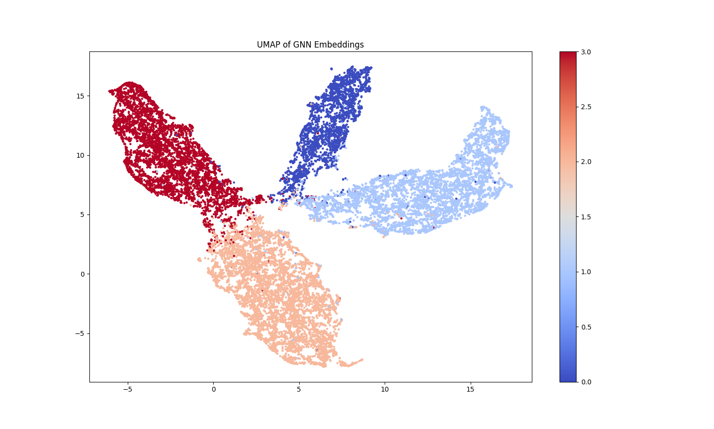

---

# GNN Model for Semi-Supervised Node Classification on Facebook Page-Page Network


## Overview
This project implements a suitable multi-layer Graph Neural Network model using Graph Attention Networks  for semi-supervised multi-class node classification. The dataset originally used is the Facebook Large Page-Page Network dataset and we used partially processed dataset, which consists of nodes with 128-dimensional feature vectors and edges representing connections between pages. The model is trained to classify the nodes based on their features and the graph structure. 
## Problem Description
The goal of this project is to perform semi-supervised node classification on a graph and  each node represents a page and edges represent relationships between pages. We use a GNN model to predict the class of each node, and evaluate the model’s performance on the test set using accuracy as the metric. Finally,the accuracy of model is very high.
## Model Architecture
- **Layer 1**: Graph Attention Layer with 8 heads.
- **Layer 2**: Graph Attention Layer with 1 head (final layer).
- **Activation Function**: ELU.
- **Output**: Log Softmax for multi-class classification.

## Training Details
- **Optimizer**: Adam with learning rate 0.01 and L2 regularization (`weight_decay=5e-4`).
- **Loss Function**: Cross-Entropy Loss for multi-class classification.
- **Learning Rate Scheduler**: Reduces the learning rate by half every 50 epochs (`gamma=0.5`).
- **Early Stopping**: Stops training if the validation loss does not improve for 10 consecutive epochs.

## Dataset
The Facebook Large Page-Page Network dataset includes:
- **Features**: 128-dimensional vectors representing each page.
- **Edges**: Connections between pages in the network.
- **Labels**: Node labels corresponding to different page categories.

The dataset is split into:
- **Training Set**: 80% of nodes.
- **Validation Set**: 10% of nodes.
- **Test Set**: 10% of nodes.

## Results
- **Best Test Accuracy**: 98.04%
- **Validation Loss**: 0.0770
- **Final Test Loss**: 0.1447

### Visualizations
A UMAP visualization of the GNN embeddings is shown below, which highlights the clustering of nodes based on their learned representations:



The UMAP plot indicates that the GNN model successfully learned the structure of the graph and distinguished between different node classes.

## Dependencies
To run this project, you will need the following dependencies:
- Python 3.8+
- PyTorch 1.10+
- torch-geometric 2.0+
- UMAP-learn 0.5+
- Matplotlib 3.4+
- scikit-learn 0.24+

To install the dependencies, you can run:

```bash
pip install torch torch-geometric umap-learn matplotlib scikit-learn
```

## How It Works
The model works by applying two layers of graph attention networks on the graph's node features and edges. GAT computes attention scores for each edge and aggregates neighboring node features accordingly. The model is trained using semi-supervised learning, where a portion of node labels is known and used to guide the classification of other nodes in the graph.

### Model Training
To train the model, use the following command:

```bash
python train.py
```

During training, the model learns to predict the class of each node based on its features and neighbors. The model is evaluated using the validation set to tune hyperparameters, and early stopping is applied to avoid overfitting.

### Model Testing
To test the model, use the following command:

```bash
python test.py
```

This script will load the trained model and evaluate it on the test set, printing the test accuracy.

### UMAP Visualization
To visualize the learned node embeddings using UMAP, run the following command:

```bash
python visualize.py
```

This will generate a UMAP plot of the node embeddings and display how well the model has separated the different node classes.

### Example Outputs
- **Predictions**:
    ```
    Predictions: tensor([0, 1, 1, ..., 0, 1, 2])
    ```

- **Training Logs**:
    ```
    Epoch: 0, Loss: 1.4992, Val Loss: 1.1625, Test Accuracy: 0.5336
    Epoch: 10, Loss: 0.4408, Val Loss: 0.4362, Test Accuracy: 0.8540
    Epoch: 190, Loss: 0.0365, Val Loss: 0.0770, Test Accuracy: 0.9804
    ```

## Preprocessing
No additional preprocessing was applied to the dataset, as it was already in a usable format with features and labels. The training, validation, and test splits were randomly generated as follows:
- **Training Split**: 80% of the nodes.
- **Validation Split**: 10% of the nodes.
- **Test Split**: 10% of the nodes.

## Possible Improvements
1. **Other GNN Variants**: Testing other GNN variants like GraphSAGE or GCN could potentially improve accuracy on this dataset.

2. **UMAP Optimization**: Tuning the UMAP parameters may result in better visual separation of the node embeddings.

## Conclusion
The GNN model with GAT layers was able to classify nodes in the Facebook Page-Page Network dataset with high accuracy. UMAP visualization also demonstrated the model’s ability to separate different node classes. Future work can explore other GNN architectures and advanced regularization techniques to further improve performance.
---